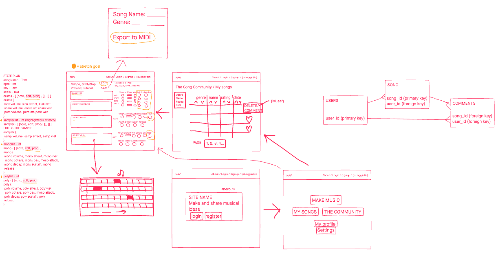
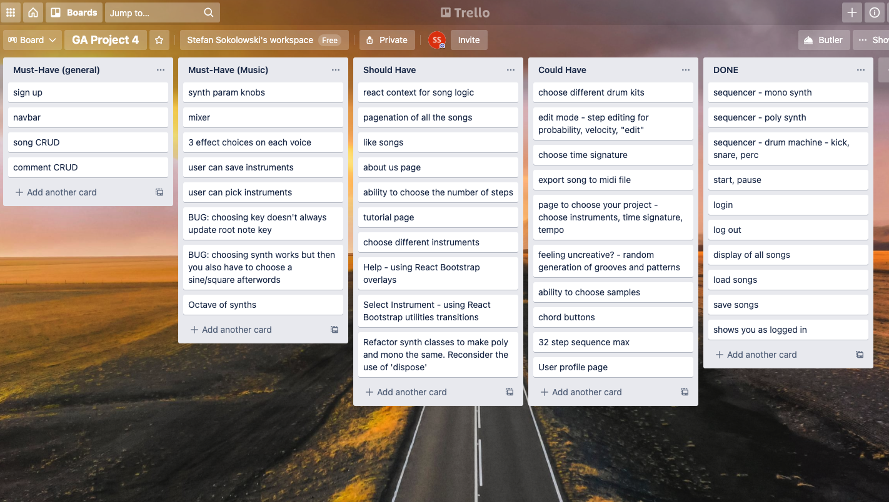
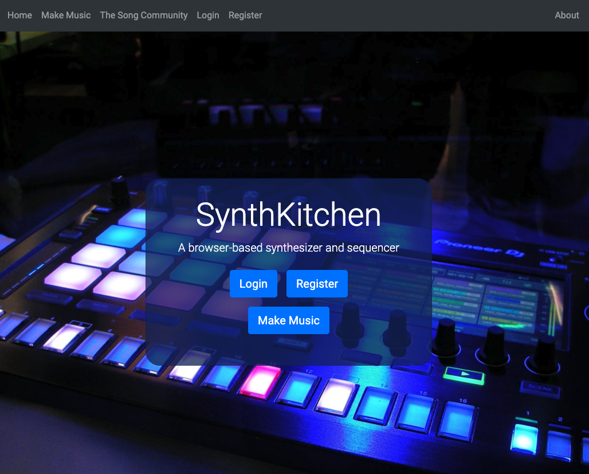
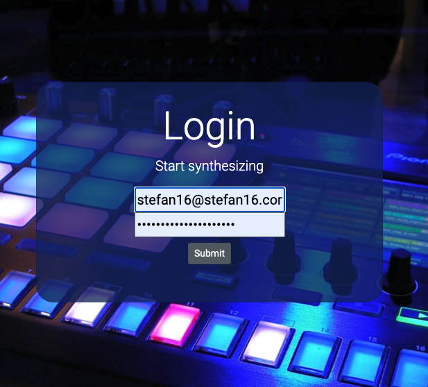
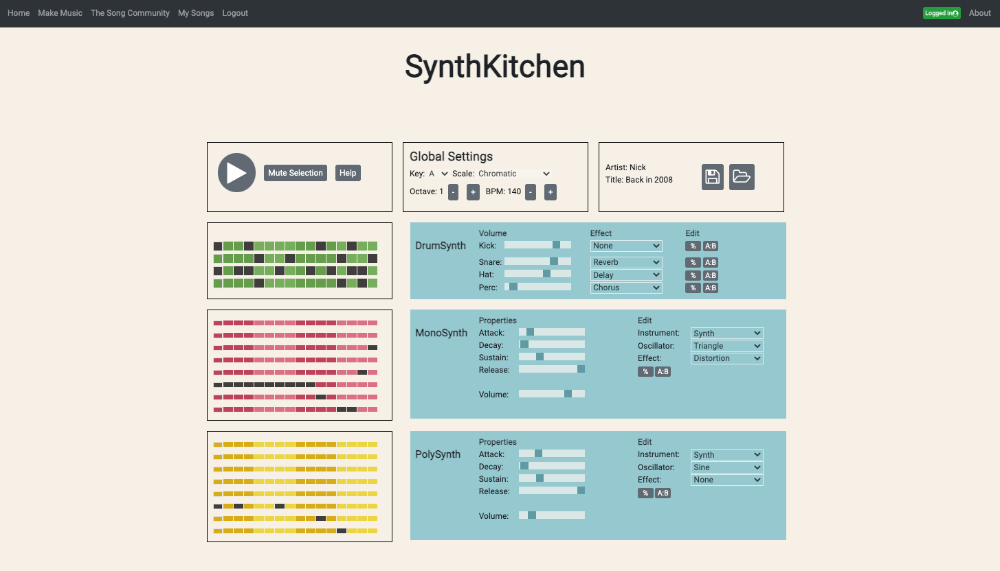
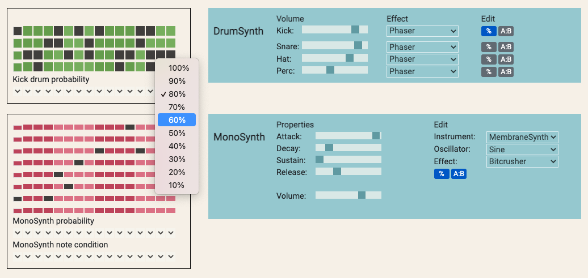
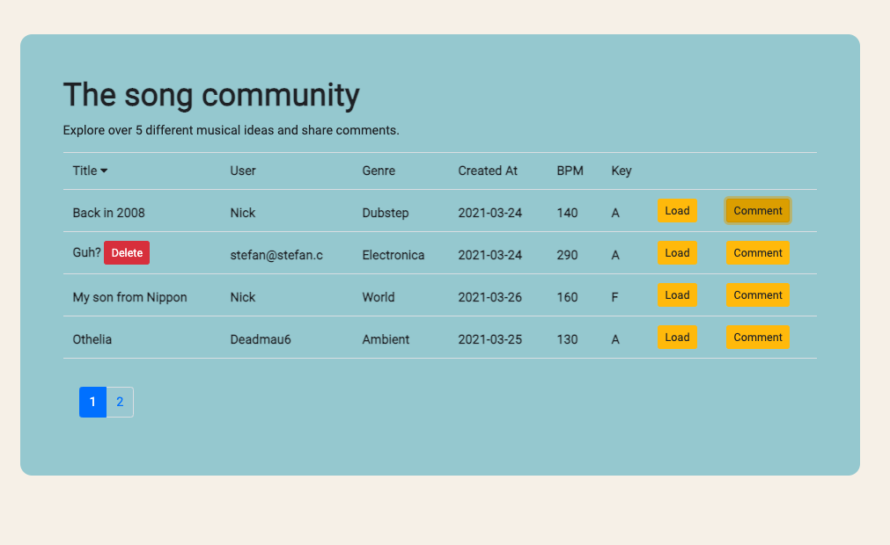
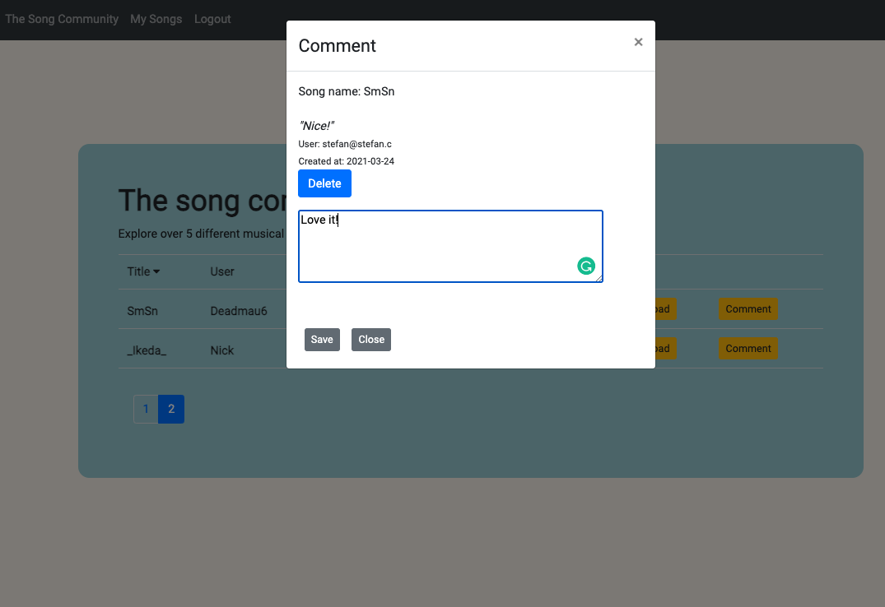

###  General Assembly, Software Engineering Immersive

# SynthKitchen - Project 4

## Overview
SynthKitchen is an app that allows users to synthesize sequences of notes and play them back in time. It features six different synthesizers that create both percussive and melodic sounds. This 7-day project could be completed either solo or in a group, and I decided to go solo so that I could immerse myself in all areas of the stack.

[Click here to use the app.](https://synthkitchen.herokuapp.com/)


### Project Brief
* Build a full-stack application by making your own backend and front-end.
* Use a Python Flask API and serve your data from a Postgres database.
* Consume your API with a separate front-end, built with React.
* Have the app be a complete product which most likely means multiple relationships and CRUD functionality.
* Implement thoughtful user stories/wireframes.
* Deployment online so that it's publicly accessible.


### Technologies used
<table>
	<tr>
		<td><b>Backend</b></td>
		<td><b>Frontend</b></td>
		<td><b>Other</b></td>
	</tr>
	<tr>
		<td>
			<ul>
				<li>Python</li>
				<li>Flask</li>
				<li>Marshmallow</li>
				<li>SQLAlchemy</li>
				<li>Bcrypt</li>
				<li>PostgreSQL</li>
				<li>Json WebToken</li>
			</ul>
		</td>
		<td>
			<ul>
				<li>HTML 5</li>
				<li>JavaScript</li>
				<li>SCSS</li>
				<li>React</li>
				<li>Axios</li>
				<li>ToneJS</li>
				<li>React Bootstrap</li>
				<li>React Router DOM</li>
				<li>Webpack</li>
			</ul>
		</td>
		<td>
			<ul>
				<li>Git / GitHub</li>
				<li>Pipenv / NPM</li>
				<li>InVision (wireframe)</li>
				<li>Trello (planning)</li>
				<li>Chrome dev tools</li>
				<li>Table Plus</li>
				<li>Insomnia</li>
			</ul>
		</td>
	</tr>
</table>


## Setting the Foundations
### InVision
I began by using a third-party tool InVision to create a wireframe of the app, working out all essential features for an MVP, planning application state and drawing out the user journey. I then focused on the Model View Controller design and used InVision to plan the models and relationships between them.



### Trello
Trello was used to recreate a Kanban agile methodology, with user stories organised as tickets for both the front end and back end.




## Backend
With a plan in place, I started with the back-end, focusing on facilitating relationships between the models and concentrating on implementing Model View Controller design. There were three models in total (users, songs, comments), as well as a base model that was extended to these models.


### Model
Below is an example of the user model which is linked to Song and Comment models. It was important to ensure the ForeignKey and relationships between models were correct, including any cascading relationships (to ensure for instance that deleting songs would not delete a user).

```
class User(db.Model, BaseModel):
    __tablename__ = 'users'

    id = db.Column(db.Integer, primary_key=True)
    created_at = db.Column(db.DateTime, default=datetime.utcnow)
    username = db.Column(db.String(15), nullable=False, unique=True)
    email = db.Column(db.Text, nullable=False, unique=True)
    password_hash = db.Column(db.String(128), nullable=True)

    songs = db.relationship('Song', backref='user', cascade="all, delete")
    comments = db.relationship('Comment', backref='user', cascade="all, delete")
```


### View
Serializers were created and tested to ensure that all required data was correctly stored and that relationships between different tables were reflected. Schemas had nested fields and ‘simple’ schemas created to ensure that there were no circular import errors. These simple schemas were also used to nest certain data within other models, e.g. displaying user information within a song without displaying all the user’s songs.

```
class UserSchema(ma.SQLAlchemyAutoSchema):

    class Meta:
        model = User
        load_instance = True
        exclude = ('password_hash',)
        load_only = ('email', 'password')
    
    songs = fields.Nested("SimpleSongSchema", many=True)

    password = fields.String(required=True)

class SimpleUserSchema(ma.SQLAlchemyAutoSchema):

    class Meta:
        model = User
        load_instance = True
        exclude = ('password_hash',)
        load_only = ('email', 'password')
    
    password = fields.String(required=True)
```


### Controller
For the controllers I built-in authorization functionality using a ```secure_route``` decorator which checked if API call’s included valid web tokens. I created several other decorators for error handling and logging API requests. CRUD functionality was tested extensively using Insomnia, a rudimentary client. Users could register and log in, as well as post, create, edit and delete both songs and comments. Once a robust back-end was in place, I began writing pseudocode for the main feature logic.


## Instruments
I used a web-audio framework ToneJS to facilitate the main musical functionality. ToneJS provides a way of manipulating ```audioContext``` to synthesize sounds in the browser. 

I created ```Instrument``` classes to create new synthesizer instances, featuring methods that could change various synthesis parameters and effects. In ToneJS, instances of effect classes need to be constructed, routed to an instrument and then disposed of, which proved challenging to deal with. I was hoping to have a single class to create instruments from, but I encountered many challenges regarding setting polyphonic synthesizer properties so I had to extend the ```Instrument``` class to a ```PolyInstrument``` class.


## Sequencer design and state
The app’s main functionality can be found within the ```Sequencer``` component - this is where all the sounds are synthesized and a user creates a “song”. Various components were created to allow the user to tweak different parameters and musical properties. Users create sequences of notes with “step sequencers”.

I decided to make use of React’s ```useContext``` hook to store song information. The App router was wrapped with a User Context provider, making it easy for information to be passed between components. When required, the context could be imported into any component as follows:

```
const { value, setValue } = useContext(UserContext)
```

All of the current song’s state is stored within a single object in context known as ```currentSong```. By keeping the majority of the song’s state in context, it offered a convenient way of lifting the state up and out of the main ```Sequencer``` component.

I designed note sequencing to be simple so that people without any knowledge of music could easily create harmonic melodies. A user can press any buttons in the step sequencer to produce a melody that will always be in tune / in key. Grids of buttons allow a user to toggle which notes will play in the musical sequence. There are three sequencers that can be used to arrange percussive sounds, monophonic sounds (one note at a time) and polyphonic sounds (more than one note at a time).

Steps in a sequencer correspond to the indices of a “root scale” which contains all the notes that can be played, as shown below:

```notes: ['A4', 'G#4', 'F#4', 'E4', 'D4', 'C#4', 'B3', 'A3']``` (the notes of the A-natural-minor scale)
E.g. ```notes[1]``` is the note ‘G#’, of octave 4 (see scientific pitch notation for more)

ToneJS makes it relatively easy to schedule events in time. ```Tone.Transport``` timing events can be passed into the arguments of callback functions. The following illustrates initializing timing in ```useEffect```, passing ```time``` into the functions that trigger notes:

```
Tone.Transport.scheduleRepeat((time) => { 
      repeat(time) // triggers oscillator 1’s steps
      repeatPoly(time) // triggers oscillator 2’s steps
      repeatDrums(time) // triggers drum steps
    }, '8n')

```

I decided to give each step some properties. Functions were written to trigger notes based on this object’s properties, including probability and condition which help to add variety to a sequence:
```playNote``` - the note to play
```probability``` - the % chance a note would play
```condition``` - conditional logic determining when a note would play

Conditional logic was based around keeping a count of how many times a sequence looped, known as a ‘round’. The user can select the rounds that steps will be active on. Below is an example of sequencing oscillator 1:

```
let index = 0
let round = 1

  const incrementLoop = (index) => {
    if (index === 0) return 1
    if (index % 16 === 0) round++ // 16 steps in each loop
    if (round === 5) round = 1
  }

  // checks for step conditions
  const checkStepCondition = (condition, round) => {
    switch (condition){
      case '1:1': // the step plays on every round
        return true
      case '2:2': // the step plays on rounds 2, 4, 6 and so on
        return round % 2 === 0 ? true : false
      default:
        return round === parseInt(condition[0]) ? true : false // the step plays on a chosen round
    }
  }

  // osc1 repeat
  const repeat = (time) => {
    const position = index % value.currentSong.osc1.length
    const synthNote = value.currentSong.osc1[position]

    // increment the sequence loop count
    incrementLoop(index)

    if (
      synthNote.playNote !== '-' && // check if a note exists
      Math.random() <= synthNote.probability && // check if a note can be triggered based on % chance
      checkStepCondition(synthNote.condition, round)
    ) osc1.play(value.currentSong.notes[synthNote.playNote], '8n', time) // ‘play’ is a method in the Instrument class that plays a note
    index++
  }

```


## Design features
The majority of design and styling was achieved using React Bootstrap which provided some great responsive design and animated elements but also had many customizable features making it slow to code. I incorporated the use of various interactive Bootstrap components to improve UX, such as ```Toast``` to point out errors, ```Tooltip``` elements to create a “help” section, and various animated components. I feel that given more time it would have been better to focus on the overall design, and it was rushed due to the time-critical nature of the assignment.


## Challenges
* Getting instruments to play in time without the app glitching.
* Chaining effects to each instrument and removing them was difficult.
* Some aspects of code are not as programmatic as they could be.
* There is some inconsistent styling used throughout the project.

### Bugs
* On occasion, when a step condition is selected, subsequent activated steps will inherit this condition.
* After a user has saved an edited version of their song sometimes they will not be able to effectively select effects.
* When a user is not logged in, they have the option to leave a comment which is not saved.
* The app does not effectively scale for mobile and the step sequencer displays incorrectly with small screen size.

If you have spotted any additional bugs, please let me know by <a href="mailto:stefansokolowski16@gmail.com">email</a>.


## Achievements
* I always had an idea to make this project before the course started, and it felt great that I was able to create it.
* Navigating a web audio framework and creating features based on reading its documentation.
* Creating an app with genuine utility and some interesting features.


##Key learnings
* Learning about the differences in app performance optimization between local development and deployment. This helped me navigate performance-based challenges with my app.
* I learnt a new framework and a lot about how to use classes in JS as a result.
* Learning about lifting state up and refactoring components.
* Learning about different hooks such as useContext.


##Features I'd like to implement
* Having a many-to-many relationship in the backend, allowing users to create instruments and presets that can be shared publicly.
* An ability to increase the sequence’s length.
* Additional features for instruments, e.g. signal filtering.


## The Finished Product











